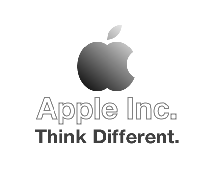

Logo Apple
---

A simple Java 2D API implementation for my college subject test.
Drawing Apple Inc. signature using primitive geometry objects and text rendering.

All trademarks are property of their respective owners.